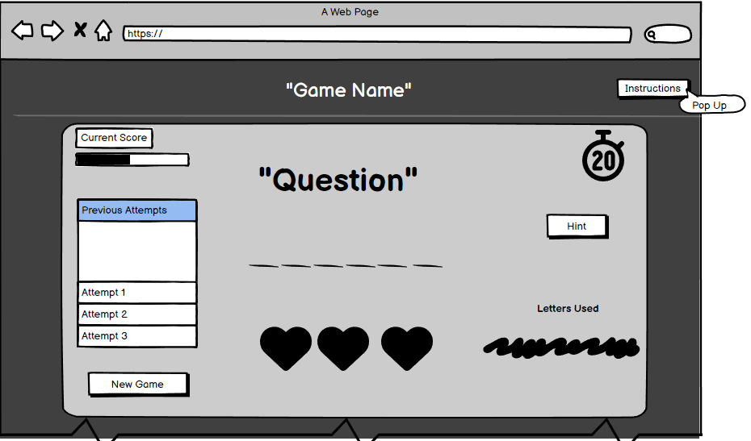
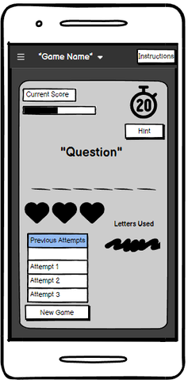
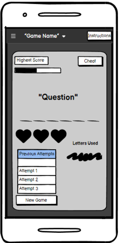
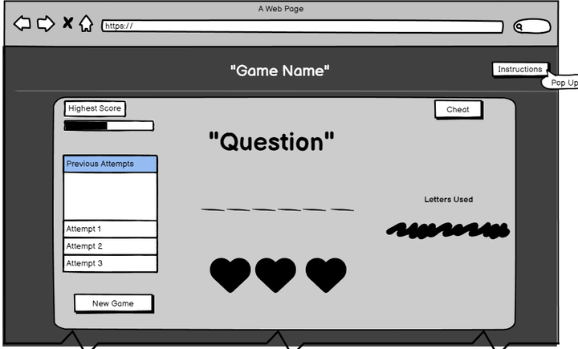
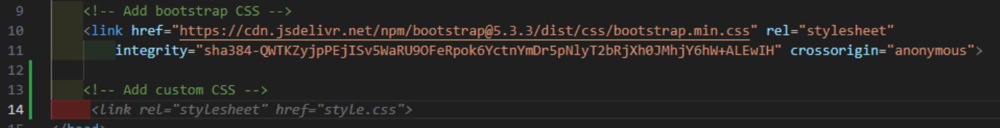
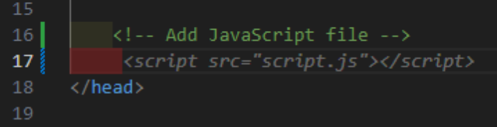
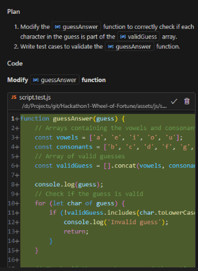
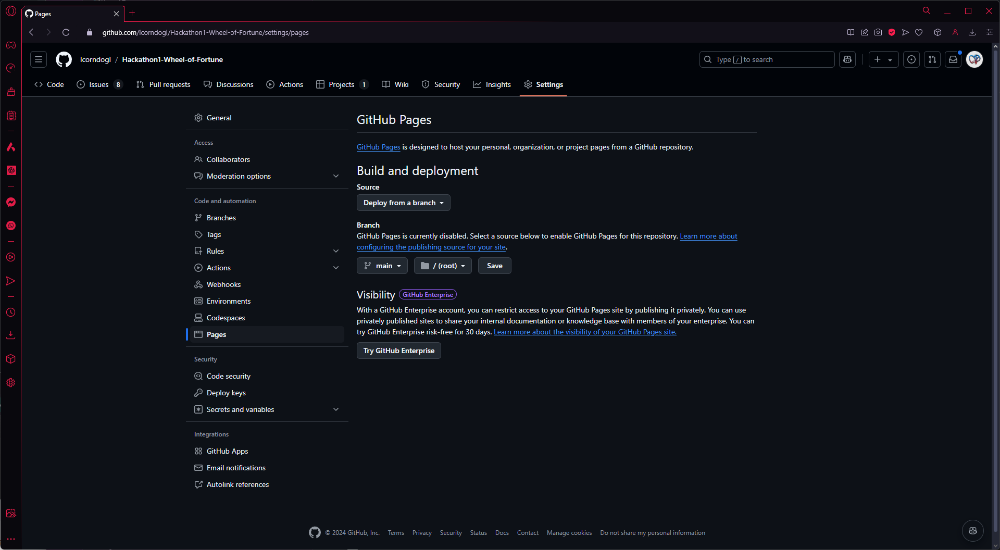
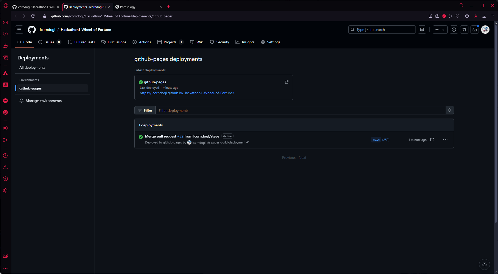

## Contents

## Proposal

We will create a text-phrase guessing game. The game will present an common, idiomatic phrase, and the user will guess vowels and consonants, or attempt to guess the phrase as a whole. Guesses will be tracked, and a score calculated at depending on how many letters were guessed before the correct answer was arrived at.

## AI Integration

As a useful tool for sampling a zeitgeist of English text, ai was helpful for presenting uncommon and common idiomatic phrases.
Ai was also used to assist with generating user stories, the content generated was hand edited for suitability.

## User Experience

### User Stories

As a user I want to be able to generate questions that show up on screen, and guess what the answer is - wheel of fortune style

As a user I want to be able to see which letters I have already guessed.

As a used I want to my current score and previous scores, along with the best score achieved.

As a user I want to be able to play the game on any device.

### Wireframing

We decided on this design based on the colours of other market-leading text games (Wordle, NYTimes and Sudoku.com).
Alternate looks were also proposed as refinements

Demonstrations of the scalability of the site to larger devices are wireframed below

## Troubleshooting

The above demonstrates Copilot missing a linked asset, and taking it's best guess at the filepath for the local CSS. This is a persistent issue with ai-generated links as demonstrated below.

## Coding with AI

This if test was one entirely derived by ai, along with the plan arrived at to refine the first solution we arrived at

## Future Features

### Implemented

High score tracking

Letters guessed colour coding - green for correct and red for incorrect

### To Implement

Add in a spinning wheel that has various sections to multiply the score for the next attempt/give random letters etc.

Adjust letters used to be an available letters - with black letters being unused, green being correct and red being incorrect.

A timer could be added to the game for a more configurable challenge. This could also be tracked across users, and used to generate leaderboards based on fastest times and highest scores.

Use of cookies to makes scores persistent across sessions, or use of a backend server to allow users to create accounts, allowing them to track their scores across multiple sessions and devices.

Other features could include social media integration, and the use of APIs to post scores to social media platforms automatically.

Graphing methods for scores over time could also be investigated and implemented.

## Design

Abdulmajeed

## Features

## Deployment

1) Add the required files to the git repository with the command `git add .`
2) Commit the changes to the repository with the command commit command `git commit -m "Final project commit"`
3) Open up the repository and go to the settings > pages menu ([Project Settings > Pages link](https://github.com/lcorndogl/Hackathon1-Wheel-of-Fortune/settings/pages))
4) Select the root directory and main branch to deploy the project 
5) Verify that the project has been deployed by going to the main repository page (Code) and checking the deployment status on the right hand side
[Link to Deployed Site](https://lcorndogl.github.io/Hackathon1-Wheel-of-Fortune/)

## Credits

[Stack Overflow - How to form an array of question/answer pairs](https://stackoverflow.com/questions/37252041/storing-quiz-questions-in-array-of-objects)

[MDN Docs - Letter spacing code snippet to ensure there is space between letters without HTML stripping out multiple space character whitespaces](https://developer.mozilla.org/en-US/docs/Web/CSS/letter-spacing)

[Cloud Convert - Image manipulation](https://cloudconvert.com/png-to-webp "Convert image filesize and format to webp")

Considerations from the WAVE validation:
form unlabelled -
The form is unlabelled by design, as it is hidden from the user.

Low-contrast header -
The header text is defined by text-shadow, the colour is identical to the background by design.

Low-contrast cheat button -
The error is caused by the similarity of the default and hover appearances and can be disregarded. Added a 1px border to the cheat button.

Skipped heading level:
By design, if we want to insert headings between in future.

Possible heading:
This refers to the game area, and wasn't styled as a heading.

Considerations from JS validation:
All of the warnings returned related to versioning, specifically with LET and CONST.

The HTML and CSS validated without error.

Bug report FIXED: Casting the lower or upper case to the method that passed red or green classes to the DOM behaved incorrectly,
colouring a correct guess red when it's case differed.
-This bug was fixed with use of toLowerCase in the last stages of development.

Design - Abdulmajeed
Features - Gameplay
Future Features - Mostly implemented (as a stretch goal, ie: colours)
-- Score Persistence
-- Some responsiveness tidy up
Technologies User - Copy pasta

Deployment - Deployment Section

Testing
--validation
--lighthouse
-- console logs as building to ensure triggers (now removed as tidy up exercise)

Bugs - 

Credits - Exists
