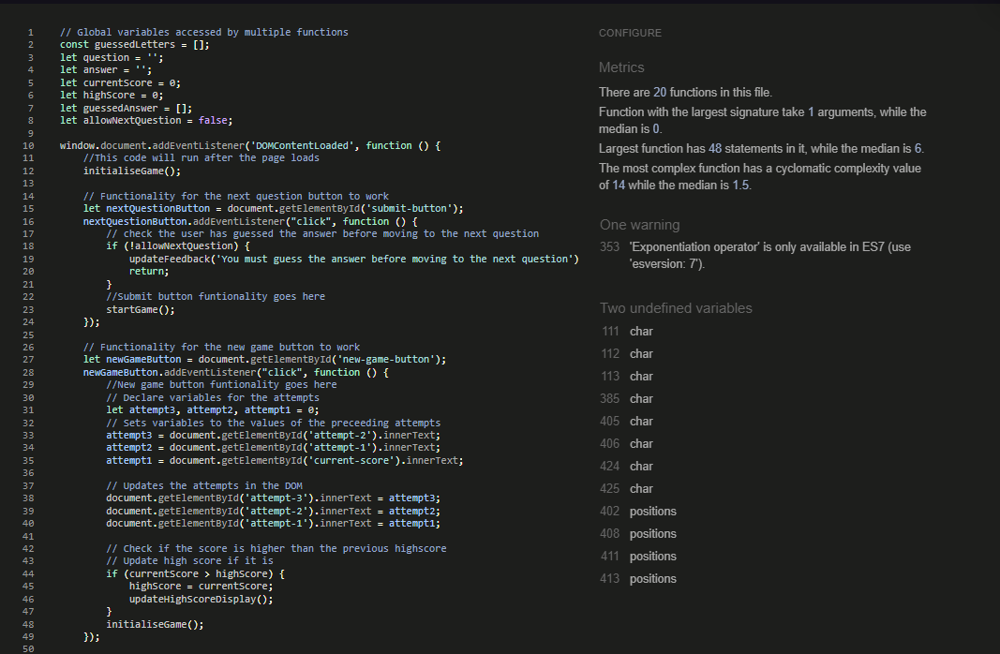

# [Deployment Link](https://lcorndogl.github.io/Hackathon1-Wheel-of-Fortune/ "Link to the live deployment")

## Contents

## Proposal

We will create a text-phrase guessing game. The game will present an common, idiomatic phrase, and the user will guess vowels and consonants, or attempt to guess the phrase as a whole. Guesses will be tracked, and a score calculated at depending on how many letters were guessed before the correct answer was arrived at.

## AI

### Integration

As a useful tool for sampling a zeitgeist of English text, ai was helpful for presenting uncommon and common idiomatic phrases.

AI was also used to assist with generating user stories, the content generated was hand edited for suitability.

AI was also used to generate the questions and answers that were used in the arrays - Manually validated and adjusted some answers which were not as expected to ensure the answers are correct.

### Codeing with AI

This if test was one entirely derived by ai, along with the plan arrived at to refine the first solution we arrived at

## User Experience

### User Stories

As a user I want to be able to generate questions that show up on screen, and guess what the answer is - wheel of fortune style.

As a user I want to be able to see which letters I have already guessed.

As a used I want to my current score and previous scores, along with the best score achieved.

As a user I want to be able to play the game on any device.

### Wireframing

We decided on this design based on the colours of other market-leading text games (Wordle, NYTimes and Sudoku.com).
Alternate looks were also proposed as refinements

Demonstrations of the scalability of the site to larger devices are wireframed below

## Future Features

### Implemented

High score tracking

Letters guessed colour coding - green for correct and red for incorrect

### To Implement

Add in a spinning wheel that has various sections to multiply the score for the next attempt/give random letters etc.

Adjust letters used to be an available letters - with black letters being unused, green being correct and red being incorrect.

A timer could be added to the game for a more configurable challenge. This could also be tracked across users, and used to generate leaderboards based on fastest times and highest scores.

Use of cookies to makes scores persistent across sessions, or use of a backend server to allow users to create accounts, allowing them to track their scores across multiple sessions and devices.

Other features could include social media integration, and the use of APIs to post scores to social media platforms automatically.

Graphing methods for scores over time could also be investigated and implemented.

## Design

We selected a black and white simplistic theme, to resemble the simplicity of the game we were creating. The title in the navbar was a real struggle, looking at the wireframes, we planned for the title to be at the centre of the page but unfortunatly we was not able implement that so we had to innovate with what we had been given and we used AI to add an hover effect to the title only revealing the title when it is hovered over but when off it stays transparent to remove the sense of the title not being in the correct place.  The border sizes was done using AI to save time from trial and error. All buttons was styled to be unique since each one serves its own function and 1 is not related to the other. Font sizes we decided on when planning our project, we was on the look out for more simple retro game style fonts to match the theme.

## Features

Instructions Modal for the user to see how to play the game.

Randomly selected question.

Guesses displayed on screen.

Letters used are updated and colour coded for correct/incorrect guesses.

Feedback to the user in case of guesses (Correct/Incorrect/Invalid).

Scores for correct guesses, per letter and a bigger amount for guessing the whole phrase.

Previous 3 games are tracked.

Highscore is tracked across a single session.

New Game button resets the game area to the start condition and updates the previous score/high score (if applicable)

Buttons react on hover so the user knows it will be the one they click.

Next Question button so the user can continue their currrent game. (Validated so it can only be used after a question is solved).

## Deployment

1) Add the required files to the git repository with the command `git add .`
2) Commit the changes to the repository with the command commit command `git commit -m "Final project commit"`
3) Open up the repository and go to the settings > pages menu ([Project Settings > Pages link](https://github.com/lcorndogl/Hackathon1-Wheel-of-Fortune/settings/pages))
4) Select the root directory and main branch to deploy the project 
5) Verify that the project has been deployed by going to the main repository page (Code) and checking the deployment status on the right hand side
[Link to Deployed Site](https://lcorndogl.github.io/Hackathon1-Wheel-of-Fortune/)

## Bugs

### Resolved

Low Contrast Header - Added text shadow around for contrast.

Low Contrast Cheat Button - Added text shadow around for contrast.

Skipped heading - Set to h1 and used the class of the relevant heading for formatting.

Casting the lower or upper case to the method that passed red or green classes to the DOM behaved incorrectly colouring a correct guess red when it's case differed - Casted to lowerCase with toLowerCase for checks in line with the rest of the code.

Next question button can be used at will - Added a boolean to say whether triggering the next question method is allowed behind the scenes.

User can repeadly make the same guess to farm score - Added validation to ensure that the guess entered is not already used, in the case of guessing the full word if the entire answer is already displayed on screen provide feedback informing the user they already solved the question.

### Unresolved

All known bugs are resolved

## Technologies Used

### HTML

Basic HTML was used to create the various areas of the page.

### CSS

CSS was used to create the styling for the page layout, including several classes and IDs that the JavaScript adds and removes from the HTML depending on the inputs.

### JavaScript

JavaScript was used to cater to all of the back end functionality of the project and provide the interactivity for the user. This includes but is not limited to:

Get question/answer pairs.

Validate Guesses (Single character/Guess entire phrase - presenting error on invalid inputs (Non-alphabetic/Non-space special characters))

### Git

Git was used for the versioning of the project. We also utilised the branch feature to prevent working on the main branch, and merging into it regularly to ensure the central code was up to date between all of us.

### GitHub

GitHub has been used as a repository for the code allowing all team members the one version of the truth with the main branch - as this was locked down to prevent working on main as well.

GitHub was also used for the deployment of the website, allowing it to be accessed from anywhere with an internet connection.

### Visual Studio Code

Visual Studio Code has been used to create the project, allowing for the use of emmet commands as well as CoPilot integration to provide feedback on code snippets and suggestions whilst writing code.

### CoPilot

CoPilot has been used for code suggestions, as well as troubleshooting logic occasionally when a statement or loop isn't working as expected in the code.

### bash terminal

Bash terminal was used for adding and commiting files, as well as swapping between branches, merging between branches and easy structure/file creation (mkdir/touch).

### nano

NaNo was used to efficiently present merge conflicts for resolution, and also to handle local commit messages upon merging main into the local branch.

## Testing

### Console Logs

Console logs were originally scattered around the JavaScript code salt-bae style to assist in seeing what code was executing, where it was breaking & that the logic was functioning as expected. These console.logs were removed at the end of the project as it was not necessary for the functioning of the project and was just used to see what was happening behind the scenes during the development phase.

### Troubleshooting

The above demonstrates Copilot missing a linked asset, and taking it's best guess at the filepath for the local CSS. This is a persistent issue with ai-generated links as demonstrated below.

### Responsivity Images

[Responsiveness Link](https://ui.dev/amiresponsive?url=https://lcorndogl.github.io/Hackathon1-Wheel-of-Fortune/ "Am I responsive link")

### Validation

#### HTML-Validation

 [HTML Validation Link](https://validator.w3.org/nu/?doc=https%3A%2F%2Flcorndogl.github.io%2FHackathon1-Wheel-of-Fortune%2F)

#### CSS-Validation

 [CSS Validation Link](https://jigsaw.w3.org/css-validator/validator?uri=https%3A%2F%2Flcorndogl.github.io%2FHackathon1-Wheel-of-Fortune%2F&profile=css3svg&usermedium=all&warning=1&vextwarning=&lang=en)

#### JavaScript-Validation

 [JS Validation Link](https://jshint.com)

#### Wave-Validation

[WAVE Validator](https://wave.webaim.org/report#/https://lcorndogl.github.io/Hackathon1-Wheel-of-Fortune/ "Link to the wave validator for the accessibility")

There were several considerations from the WAVE validation which we have reviewed and decided upon the appropriate actions for, these are:

Errors - The error was in relation to an unlabelled form element, however this element is solely used to provide feedback to the user, as such it is supposed to be invisible unless there is any feedback to give to the user which will populate the content via JavaScript.

Contrast Errors - These are returned on the game title and cheat button. We decided the best way to deal with these would be the use of a 1px text-shadow on them to enforce contrast and readability between the text and any possible background. The WAVE validator doesn't seem to take this into account when checking for accessibility as you can't get much more contrasting than white and black.

Possible Heading - This is because the WAVE tool places very high prominence on the user-guess field which it is assuming is an important heading element.

### Lighthouse Scores

#### Mobile-Lighthouse-Score

#### Desktop-Lighthouse-Score

## Credits

[Stack Overflow - How to form an array of question/answer pairs](https://stackoverflow.com/questions/37252041/storing-quiz-questions-in-array-of-objects)

[MDN Docs - Letter spacing code snippet to ensure there is space between letters without HTML stripping out multiple space character whitespaces](https://developer.mozilla.org/en-US/docs/Web/CSS/letter-spacing)

[Cloud Convert - Image manipulation](https://cloudconvert.com/png-to-webp "Convert image filesize and format to webp")